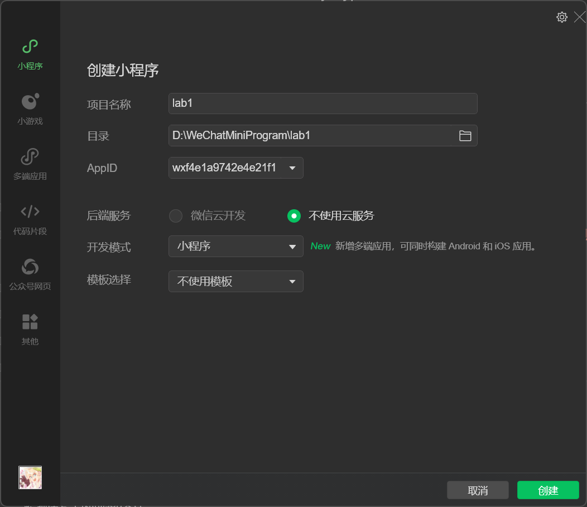

# 2022年夏季《移动软件开发》实验报告


<center>姓名：缪纬韬  学号：22020007160</center>

| 姓名和学号         | 缪纬韬，22020007160                                        |
| ------------------ | ---------------------------------------------------------- |
| 本实验属于哪门课程 | 中国海洋大学24夏《移动软件开发》                           |
| 实验名称           | 实验1：第一个微信小程序                                    |
| Github仓库地址     | https://github.com/spchara/remote-software-develop-lab.git |


## **一、实验目标**

1. 学习使用快速启动模板创建小程序的方法；

2. 学习不使用模板手动创建小程序的方法。


## 二、实验步骤

### 1 模板创建小程序

#### 1.1 创建项目

下载安装完成开发者工具后，点击创建小程序

填写一个项目名称，使用一个空文件夹作为项目路径，使用测试号，不使用云服务，最后在模板中选择js-基础模板即可，点击创建


#### 1.2 使用

创建完成后，点击最上方的编译，即可在左边的模拟器中看到预览结果


使用效果就是当点击头像时，可以使用自己的头像来替换，点击昵称时，可以选择自动填入微信昵称


### 2 手动创建小程序

#### 2.1 创建项目

打开微信开发者工具，填写项目名称、项目路径、appId暂时使用测试号，后端服务勾选不适用云服务，并不使用模板，创建新项目

#### 2.2 修改导航栏样式
首先按照要求，修改导航栏的背景色，代码如下，用参数`color`设置颜色，参数`background`设置16进制背景色

    ```html
    <navigation-bar title="手动创建第一个程序" back="{{false}}" color="white" background="#663399">
    ```
    
    

#### 2.3 创建视图
接下来完成视图元素的摆放，需要放置一个`<image>`,`<text>`和一个`<button>`

具体代码为:

```html
<!--index.wxml-->
<navigation-bar title="手动创建第一个程序" back="{{false}}" color="white" background="#663399">
</navigation-bar>
<scroll-view class="scrollarea" scroll-y type="list">
  <view class="container">
      <view class="userinfo">
        <image class="avatar" mode="cover" src="{{userInfo.avatarUrl}}"></image>
        <view class="nickname-wrapper">
          <text class="nickname-label">昵称</text>
          <text >{{userInfo.nickName}}</text>
        </view>
      </view>
    <button size="default" type="default" hover-class="button-hover" bind:tap="getAvatarAndName">获取头像和昵称</button>
  </view>
</scroll-view>
```

对应的css:

```css
/**index.wxss**/
page {
  height: 100vh;
  display: flex;
  flex-direction: column;
}
.scrollarea {
  flex: 1;
  overflow-y: hidden;
}

.avatar {
  width: 100px;
  height: 100px;
  object-fit: cover;
  border-radius: 20px; 
  margin: 30rpx;
}

.userinfo {
  display: flex;
  flex-direction: column;
  align-items: center;
  color: #aaa;
  width: 80%;
}

.nickname-wrapper {
  display: flex;
  width: 100%;
  padding: 16px;
  box-sizing: border-box;
  border-top: .5px solid rgba(0, 0, 0, 0.1);
  border-bottom: .5px solid rgba(0, 0, 0, 0.1);
  color: black;
}

.nickname-label {
  width: 105px;
}
```


#### 2.4 业务逻辑

使用`bind:tap="getAvatarAndName"`将获取头像和昵称的js函数绑定到按钮上

在`index.js`中我们定义了`userInfo`数组对象，包含`avataoUrl`和`nickName`两个元素，它们一开始用于保存默认的头像（小灰人）以及默认名称（微信昵称）

```js
  data: { 
    userInfo: {
      avatarUrl: defaultAvatarUrl,
      nickName: '微信昵称',
    }
  },
```

在`getAvatarAndName`函数中，我们直接调用wx提供的接口函数`wx.getUserProfile`，并在成功后将原本的数据元素替换掉

```js
getAvatarAndName(e) {
    wx.getUserProfile({
        desc: '获取头像与昵称',
        success: (res) => {
            console.log(res)
            this.setData({
                userInfo: res.userInfo,
            })
        }
    })
}
```
我们可以通过console.log来观察返回的查询结果,其中`avatarUrl`就是用户的头像路径了，`nickName`则是微信昵称
```js
userInfo:
    avatarUrl: "https://thirdwx.qlogo.cn/mmopen/vi_32/Q0j4TwGTfTInShcaY9KZ8EG228QUuNmGbmk4f4qAEibs7RFbkmiaKzOfzV5CXmKCODaUDKShmyNabBRX9UBOCGUA/132"
    city: ""
    country: ""
    gender: 0
    language: "zh_CN"
    nickName: "猹拉"
    province: ""
    constructor: (...)
    hasOwnProperty: (...)
    isPrototypeOf: (...)
    propertyIsEnumerable: (...)
    toLocaleString: (...)
    toString: (...)
    valueOf: (...)
    __defineGetter__: (...)
    __defineSetter__: (...)
    __lookupGetter__: (...)
    __lookupSetter__: (...)
```
至此程序就可以正常运行了

## 三、程序运行结果

点击前：


获取请求：


获取成功：


## 四、程序主要代码

#### index.wxml

```html
<!--index.wxml-->
<navigation-bar title="手动创建第一个程序" back="{{false}}" color="white" background="#663399">
</navigation-bar>
<scroll-view class="scrollarea" scroll-y type="list">
  <view class="container">
      <view class="userinfo">
        <image class="avatar" mode="cover" src="{{userInfo.avatarUrl}}"></image>
        <view class="nickname-wrapper">
          <text class="nickname-label">昵称</text>
          <text >{{userInfo.nickName}}</text>
        </view>
      </view>
    <button size="default" type="default" hover-class="button-hover" bind:tap="getAvatarAndName">获取头像和昵称</button>
  </view>
</scroll-view>

```

#### index.wxss

```css
/**index.wxss**/
page {
  height: 100vh;
  display: flex;
  flex-direction: column;
}
.scrollarea {
  flex: 1;
  overflow-y: hidden;
}

.avatar {
  width: 100px;
  height: 100px;
  object-fit: cover;
  border-radius: 20px; 
  margin: 30rpx;
}

.userinfo {
  display: flex;
  flex-direction: column;
  align-items: center;
  color: #aaa;
  width: 80%;
}

.nickname-wrapper {
  display: flex;
  width: 100%;
  padding: 16px;
  box-sizing: border-box;
  border-top: .5px solid rgba(0, 0, 0, 0.1);
  border-bottom: .5px solid rgba(0, 0, 0, 0.1);
  color: black;
}

.nickname-label {
  width: 105px;
}
```

#### index.js

```js
// index.js

const defaultAvatarUrl = 'https://mmbiz.qpic.cn/mmbiz/icTdbqWNOwNRna42FI242Lcia07jQodd2FJGIYQfG0LAJGFxM4FbnQP6yfMxBgJ0F3YRqJCJ1aPAK2dQagdusBZg/0'

Page({
  data: { 
    userInfo: {
      avatarUrl: defaultAvatarUrl,
      nickName: '微信昵称',
    }
  },
  onChooseAvatar(e) {
    const { avatarUrl } = e.detail 
    this.setData({
      "userInfo.avatarUrl": avatarUrl,
    })
  },
  
  getAvatarAndName(e) {
    wx.getUserProfile({
      desc: '获取头像与昵称',
      success: (res) => {
        console.log(res)
        this.setData({
          userInfo: res.userInfo,
        })
      }
    })
  },
})
```

## 五、问题总结与体会

由于之前接触过一些网页项目，所以初上手微信小程序感觉还是挺熟悉的，不过在实验的过程中遇到了一个问题

一开始我调用`wx.getUserProfile`或者`wx.getUserInfo`的时候，返回的头像链接固定为小灰人，名称为“微信用户”，如下：

```
userInfo:
    avatarUrl: "https://thirdwx.qlogo.cn/mmopen/vi_32/POgEwh4mIHO4nibH0KlMECNjjGxQUq24ZEaGT4poC6icRiccVGKSyXwibcPq4BWmiaIGuG1icwxaQX6grC9VemZoJ8rg/132"
    city: ""
    country: ""
    gender: 0
    is_demote: true
    language: ""
    nickName: "微信用户"
......
```

在一番查找之后我发现[小程序用户头像昵称获取规则调整公告 | 微信开放社区 (qq.com)](https://developers.weixin.qq.com/community/develop/doc/00022c683e8a80b29bed2142b56c01?highLine=%E8%8E%B7%E5%8F%96%E5%A4%B4%E5%83%8F)发现，微信方面认为在用户刚打开小程序时就要求收集用户的微信昵称头像是不太合理的，因此在后续的标准库更新之后，收回了两个api的功能，**他们将统一返回头像链接为灰色头像，用户名称为“微信用户”**


在更高的版本中，小程序不能直接获取到这些东西了，只能在选择头像的时候，通过在button中添加属性`open-tpye=open-type="chooseAvatar"`,让用户在小程序中主动更改头像时，可以直接选择自己微信的头像。总体来说，就是将主动权交给了用户

那我们该如何进行实验呢？答案就是**调整标准库的版本**，通过把标准库版本跳到2.27.0以下，来使用未被限制的`wx.getUserProfile`或者`wx.getUserInfo`。


不过如果采用真机调试的话，基础库版本取决于我们的手机，所以真机调试上无法正常运行

当然这种方式只是用于实验，如果是实际开发中还需要跟随着微信的更新来更新自己的业务代码

总体来说，通过今天的实验，我对微信小程序的框架，有了一些具体的认识，接下来继续更深的学习