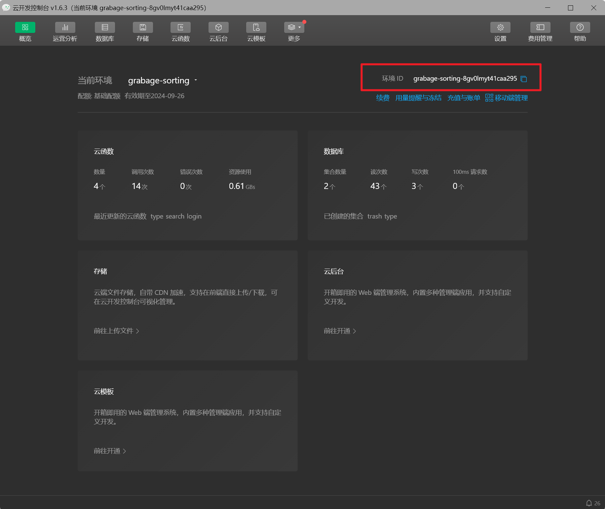

# 2024年夏季《移动软件开发》实验报告

姓名：缪纬韬  学号：22020007160

| 姓名和学号         | 缪纬韬，22020007160                                        |
| ------------------ | ---------------------------------------------------------- |
| 本实验属于哪门课程 | 中国海洋大学24夏《移动软件开发》                           |
| 实验名称           | 实验3：微信小程序云开发                                    |
| Github仓库地址     | https://github.com/spchara/remote-software-develop-lab.git |

## **一、实验目标**

 学习微信小程序云开发的基础知识。完成利用文本搜索、图像识别的垃圾分类功能

## 二、实验步骤

#### 1 导入项目

从gitee下载项目，并使用微信开发者工具导入

注意appid需要填写在`mp.weixin.qq.com`所申请的id

由于本次需要使用微信云服务，所以后端服务选择微信云开发

#### 2 注册百度智能云

注册百度智能云，进行一连串的实名认证

领取百度提供的免费资源，申请一个图像识别的ai接口

#### 3 填入api key

在目录`garbage-sorting-applet-master\miniprogram\pages\search\`下的`search.js`文件内，填写刚刚申请得到的`api key`和`secret key`

#### 4 创建微信云环境

点击开发工具左上角的云开发，创建一个云环境，我将其命名为garbage-sorting

#### 5 填写云环境id

在云环境控制台的概览中，右上角找到云环境id，复制

找到项目中的`app.js`文件，将id填写与对应位置

#### 6 上传云函数

对`cloudfunction`中的四个云函数分别右键，选择`上传并部署：云端安装依赖（不上传node modules）`

**注意：这里可能会遇到报错提示，提示要求先创建云环境，可能是刚才还没反应过来，重启项目解决**

#### 7 上传数据集

点击云开发控制台->数据库，左上角创建集合，分别创建名为`trash`和`type`的两个集合，并导入老师群里发的数据集

#### 8 确认appId已填入

appId应填写于`project.config.json`中的对应位置，如果项目创建的时候已经填写，这里应该会自动填入

#### 9 万事俱备只欠东风

启动真机调试，成功

## 三、程序运行结果

图像识别

## 四、问题总结与体会

### 问题：

+ Q：第一次运行的时候遇到了报错

    

    解决方法：显然这和上次实验是同一种问题，微信小程序调用api是需要提前设置合法域名的

    

+ Q：返回结果是没有找到任何结果

    因为百度云实际上没有提供资源

    需要先到百度智能云上领取一些免费资源，领取过几分钟之后就可以正常使用了

    

### 体会

这次实验体会了使用云服务的过程。云服务确实给我们这些条件不足的学生开发者提供了很多便利，能让很多想法不被硬件条件所限制，之后我会继续学习云服务的使用方法